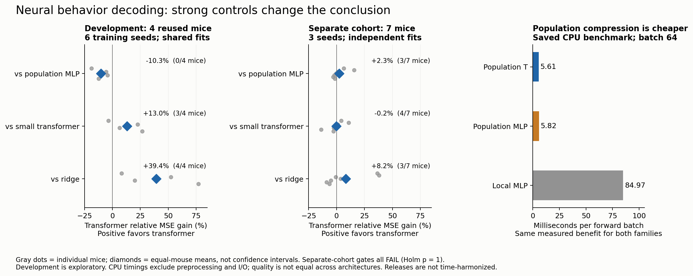
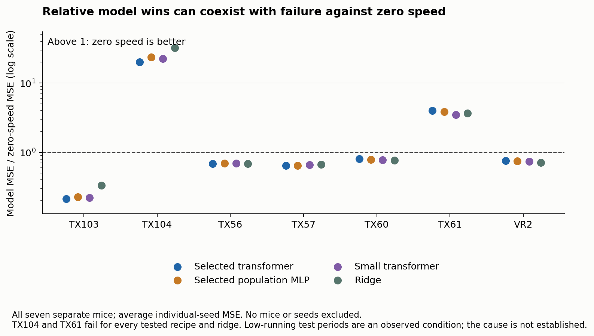

# Neural Behavior Decoding

**What survives strong baselines and separate-recording validation?**

A research-engineering study of mouse running-speed decoding from population calcium activity. It compares transformers, MLPs and ridge regression, then asks whether apparent improvements survive matched controls, additional training seeds and seven separate mouse recordings.

**Result:** useful decoding in some recordings, cheaper population-based architectures, and no validated transformer advantage over the strongest simpler controls. The contribution is the controlled comparison and reproducible failure analysis—not a claim of a new state-of-the-art decoder.


*Recorded activity and saved predictions, replayed together. TX103 · seed 401 · fixed midpoint excerpt. Mouse gait illustrates speed; it is not animal video.* [Static preview](portfolio/visualization/preview.png) · [Interactive viewer guide](portfolio/visualization/README.md)

## Findings worth keeping



| Question | What the evidence supports | Important limit |
| --- | --- | --- |
| Can neural activity predict running? | Yes in some recordings; the selected transformer reached R² 0.471 and 0.123 on two separate mice. | Five of seven separate mice had R² below 0.01; this is not a reliable general decoder. |
| Does a well-tuned transformer beat a strong MLP? | On four reused development mice it had **10.28% higher MSE**. On seven separate mice, independent fits averaged **2.33% lower MSE**. | The separate result won only **3/7 mice**, had **1.20% worse MAE**, and failed the frozen gates; Holm-adjusted p = 1. |
| Is population compression useful engineering? | Measured CPU batch-64 forwards took **5.61 ms** for the population transformer, **5.82 ms** for the population MLP and **84.97 ms** for the local-neuron MLP. | Roughly 15× faster in this benchmark; both population families benefit. Hardware-specific, excludes preprocessing/I/O, and accuracy is not equal. |
| Did correct neuron coordinates add dependable value? | In the earlier controlled fixed-cell study, correct coordinates improved MSE by **0.50%** over omitted coordinates. | Uncertainty intervals crossed zero; both gates failed. An exact ID-embedding compensation explains redundancy in that additive tokenizer. |
| What did separate validation expose? | **Zero speed beat every tested neural recipe and ridge on two mice.** Transformer MSE was **20.01× / 3.99×** the zero-speed error. | Both test periods had less running than training. This identifies a failure condition, not its cause. |

Relative effects average individual-seed errors within each mouse, then weight mice equally. Development and separate-cohort results are not pooled. The separate comparison tests fixed **training recipes fitted anew within each recording**, not transfer of pretrained weights to unseen mice. Physical time scales and publisher preprocessing were not harmonized between releases.

## Inspect or reproduce

- **[Core code tour](docs/CODE_TOUR.md):** six files to understand the data, transformer, MLP, training, ridge and evaluation.
- **[Training guide](docs/TRAINING.md):** prepare a public recording and fit the fixed independent-recording recipes.
- **[Interactive Neural Observatory](portfolio/visualization/index.html):** orbit the 3D neuron population and compare recorded running with transformer, MLP and ridge animations; works offline. [Viewer guide](portfolio/visualization/README.md).
- **[Research report](portfolio/RESEARCH_REPORT.md):** the project story, architecture, results, limitations and remaining questions.
- **[Exact results](portfolio/results/RESULTS.md):** all finalist comparisons, absolute accuracy and links to machine-readable tables.
- **[Evidence ledger](portfolio/EVIDENCE.md):** which claims are supported, uncertain or unsupported.
- **[Reproduction guide](portfolio/REPRODUCIBILITY.md):** rebuild the saved-prediction results without raw neural data or training.
- **[Presentation kit](portfolio/PRESENTATION.md):** a short pitch, project bullets and a three-minute walkthrough.
- **[Archive catalog](portfolio/data/ARCHIVE.md):** navigate all 54 experiment folders without treating them as independent studies.
- **[Complete experiment record](research/EXPERIMENTS.md):** original sources, protocols, run histories and results, including unsuccessful and stopped work.

From the repository root, in an environment with the listed dependencies:

```bash
python3 -m pip install -r portfolio/requirements.txt
python3 portfolio/rebuild.py
```

The compact bundle contains all four development mice, six finalist recipes and six seeds, plus all seven separate mice, both fitting regimes, three neural recipes and three seeds. Ridge and constant controls are included. Rebuilding recomputes **303 metric rows** and checks them against the archived results; it does not train or import a neural model. It produces CSV/JSON tables and standalone PNG/PDF figures.



## Scope and provenance

The recent systematic search, continuous-search synthesis and separate validation account for **572 new neural fits** (440 + 60 + 72), with additional earlier work documented in the archive. This is a bounded, extensively searched design space—not exhaustive coverage of all transformers. Four development mice were repeatedly examined. Seven later mice were reserved for a fixed-recipe comparison; those recordings are now examined too. Seeds and overlapping windows are not additional animals.

Data come from the [Stringer et al. spontaneous recordings](https://figshare.com/articles/Recordings_of_ten_thousand_neurons_in_visual_cortex_during_spontaneous_behaviors/6163622) and the [Stringer-coauthored Facemap v2 release](https://janelia.figshare.com/articles/dataset/Facemap_a_framework_for_modeling_neural_activity_based_on_orofacial_tracking/23712957/2). Credit belongs to the original experimental teams. This project performs a secondary analysis; it did not collect these recordings. [Methods and related work](portfolio/RESEARCH_REPORT.md#data-and-related-work) distinguish this benchmark from existing neural transformers.

## Code layout

| Directory | Purpose |
| --- | --- |
| `decoding/` | Readable, import-safe data preparation, transformer/MLP, training, ridge and held-out scoring |
| `docs/` | Code tour and exact training commands |
| `portfolio/` | Main findings, compact predictions, reproducible figures and offline 3D viewer |
| `experiments/` | Unmodified historical source, protocols, reports, histories and result records |
| `research/` | Complete archive inventory, early pilots, original prototype and cleanup verification |
| `tests/` | Small synthetic checks and optional local-checkpoint compatibility check |

The clean model matches all **72 archived initial states exactly** and **2,016 sampled saved predictions within 4.77e-7**. Seven synthetic tests cover the new pipeline. These checks verify cleanup; they do not change the scientific result. No completed experiment was retrained during packaging. The training CLI supports independent recording fits; the historical archive retains shared training and the full search. Raw recordings, prepared arrays and trained checkpoints are excluded from Git.

The animated preview above plays directly in GitHub. To explore the running mice and neurons interactively, download or clone this repository and open `portfolio/visualization/index.html` in a browser. The full viewer works offline with the adjacent files; [static preview](portfolio/visualization/preview.png).

Original code and prose: [MIT](LICENSE). Source datasets and included derivatives: [CC BY-NC 4.0 attribution and terms](NOTICE.md). Neural generation remains future work. Transformer superiority has not met the scientific gate.
