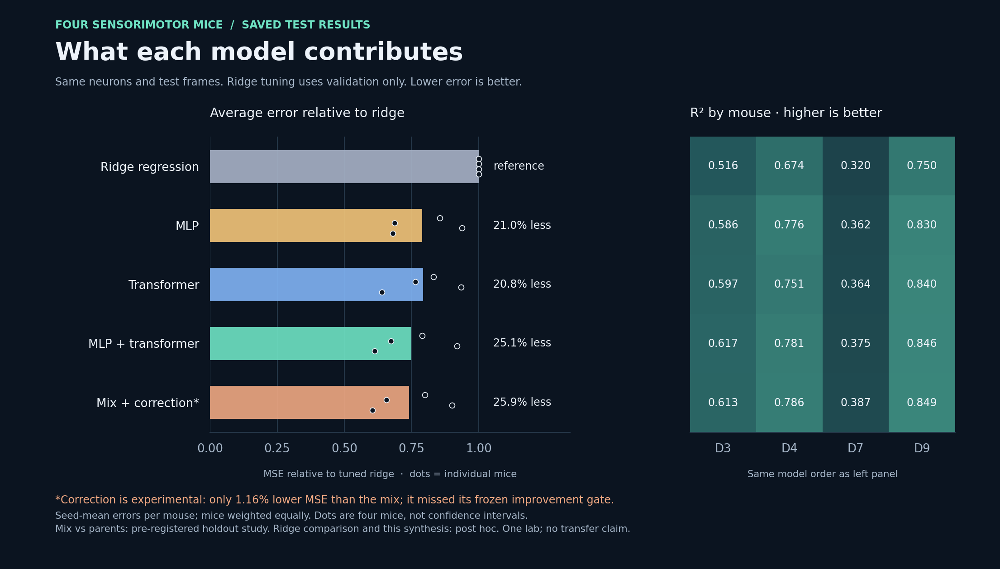
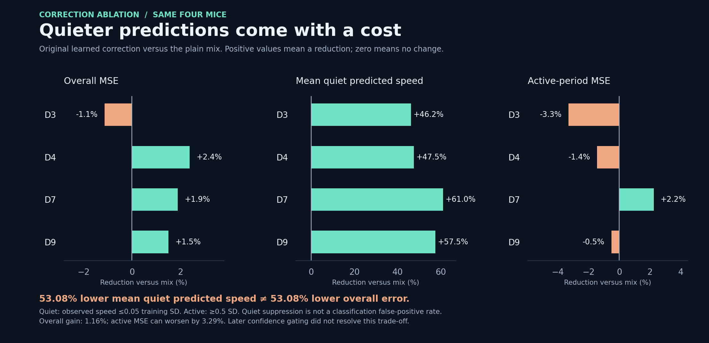
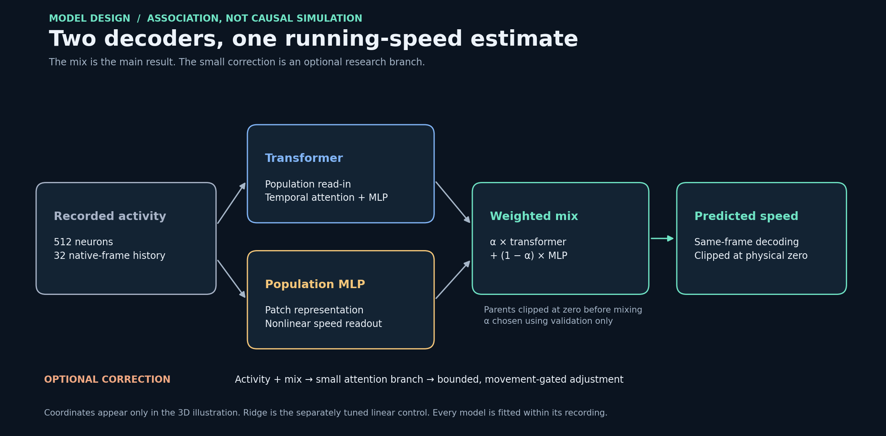

# Neural Behavior Decoding

**From 512 recorded neurons to a mouse’s running speed.**

A research portfolio comparing linear regression, an MLP, a transformer, and their combined predictions on public neural recordings. The strongest practical result is a simple **MLP–transformer ensemble**: on four sensorimotor mice, it reduced mean relative test MSE by **25.1% versus tuned ridge regression** and **about 5% versus either standalone neural model**.

[Results](#findings-worth-keeping) · [How it works](#how-it-works) · [Code tour](docs/CODE_TOUR.md) · [Research report](portfolio/RESEARCH_REPORT.md) · [Experiment archive](research/EXPERIMENTS.md)


*One synchronized quiet → walking → quiet excerpt. D3 · paired seed 401 · fixed 3D view. The mouse gait illustrates speed; it is not animal video. The clip is selected from observed behavior, not prediction accuracy. Full-test scores for the displayed seed stay visible.* [Static preview](portfolio/visualization/preview.png) · [Offline interactive viewer](portfolio/visualization/README.md)

## Findings worth keeping



| Model | Mean relative MSE reduction vs tuned ridge | Mouse wins vs ridge | Role |
| --- | ---: | ---: | --- |
| Ridge regression | Reference | — | Validation-tuned linear baseline |
| MLP | 21.00% | 4/4 | Strong nonlinear baseline |
| Transformer | 20.75% | 4/4 | Temporal attention model |
| **MLP + transformer** | **25.10%** | **4/4** | **Main combined model** |
| Mix + learned correction | 25.94% | 4/4 | Experimental refinement; trade-off below |

These numbers use the **same four mice, neurons and test frames**. We average errors over three seeds within each mouse, then weight mice equally; we do not pool raw errors across recordings. Ridge chooses regularization and a 16/32/64-frame history using validation only. The neural parents use 32 frames. Against a matched 32-frame ridge, the mix gains 27.85%. [Exact table](portfolio/results/current_models.csv) · [Ridge comparison and audit](experiments/2026-10-07_holdout_ridge/ASSESSMENT.md)

**The mix improves on both parents.** In the pre-registered holdout comparison, it reduced MSE by **5.64% versus the transformer** and **5.34% versus the MLP**, winning on all four mice against each. The additional ridge comparison above was **post hoc**, after the neural results were known. This is a practical result on this cohort, not proof of universal superiority. [Holdout assessment](experiments/2026-10-07_holdout_confirmation/ASSESSMENT.md)

**Averaging is the dependable ingredient.** Same-cost controls found that averaging two independently trained transformers, or two MLPs, performs similarly to mixing architectures. Across seven visual mice and four sensorimotor mice, two-seed averages improved mean relative MSE by 5.4–6.1%; three-seed averages by 7.2–8.1%. The same-family and combined 11-mouse analyses are post hoc. Training and inference cost increase roughly 2–3×. We did not establish a reliable transformer advantage over the MLP. [Ensembling results](experiments/2026-10-07_ensemble_check/ASSESSMENT.md)

<details>
<summary>Same-family ensemble controls and earlier findings</summary>

| Cohort | Model | Two-seed MSE reduction vs single | Mouse wins | Three-seed reduction |
| --- | --- | ---: | ---: | ---: |
| Seven visual mice | Transformer | 5.41% | 7/7 | 7.22% |
| Seven visual mice | MLP | 5.87% | 7/7 | 7.82% |
| Four sensorimotor mice | Transformer | 6.05% | 4/4 | 8.07% |
| Four sensorimotor mice | MLP | 6.08% | 4/4 | 8.11% |

The later TX60 session is descriptive and adds no independent mouse. Earlier seven-mouse single-model comparisons were mixed: the transformer beat ridge on only 3/7 mice, and zero speed beat every tested neural recipe and ridge on two low-running recordings. Those results remain in the [historical results](portfolio/results/RESULTS.md); the newer four-mouse result does not erase them.

Other retained findings: population compression substantially reduced measured CPU forward cost for both neural families; correct coordinates did not add dependable predictive value in the tested fixed-cell setup. Coordinates are used for the visualization. [Evidence ledger](portfolio/EVIDENCE.md) · [Earlier overview](portfolio/results/overview.png) · [Zero-speed controls](portfolio/results/zero_speed_control.png)

</details>

## Why the correction stays experimental



The correction lowers mean quiet-frame predicted speed by **53.08%**, but lowers overall MSE only **1.16% beyond the mix** and worsens active-period MSE by up to **3.29%**. It failed its frozen 5% improvement requirement. The GIF includes it to show the trade-off; it is not the recommended default. A later confidence-gated variant did not resolve the problem. [Correction result](experiments/2026-10-07_holdout_confirmation/ASSESSMENT.md) · [Confidence-gating follow-up](experiments/2026-10-07_confidence_gate/ASSESSMENT.md)

## How it works



Each parent learns to decode running speed from a short history of the same 512 neurons. The transformer uses temporal attention; the MLP provides a strong nonlinear comparison. A weight chosen on validation data combines their nonnegative predictions. The optional correction adds a small, bounded adjustment informed by activity and a learned movement score.

This is **within-recording decoding**, fitted separately for each mouse—not a pretrained model transferred to unseen animals, future-speed forecasting, or a causal simulation. The clean [`decoding/`](decoding/) package teaches the standalone models; the evaluated mix and correction recipes are preserved in the [holdout experiment](experiments/2026-10-07_holdout_confirmation/holdout.py).

## Evaluation and limits

- **Chronological train/validation/test splits**, gaps, training-only normalization, fixed seeds and simple constant controls. Validation selects checkpoints, ridge settings and mixing weights.
- **Original holdout process:** recipe frozen before download; all model checkpoints locked before scoring; independent audits passed. The later ridge and same-family ensemble comparisons are labeled post hoc.
- **Data integrity:** later TX61/VR2 files contained D7’s running trace and were excluded; D8 failed the preset flat-training-target rule. Four sensorimotor recordings used a start-aligned common prefix for a two-frame mismatch under an amendment approved before numerical values were read. This does not independently verify sensor timing.
- **Scope:** four sensorimotor mice in the headline comparison, one lab; seeds are not extra animals. No novelty, statistical-significance or deployment-readiness claim. The earlier seven visual mice include substantial failures. Physical sampling support was not harmonized between releases.

[Protocols and data issues](experiments/2026-10-07_holdout_confirmation/ASSESSMENT.md) · [Full research report](portfolio/RESEARCH_REPORT.md) · [Claim boundaries](portfolio/EVIDENCE.md)

## Explore and reproduce

**Start with the code:** [six-file code tour](docs/CODE_TOUR.md) · [training guide](docs/TRAINING.md). The visualization and diagnostic archive are separate from the core learning path.

**Open the interactive replay:** clone or download the repo, then open `portfolio/visualization/index.html` in a browser. All four mice, three paired seeds and complete test intervals are available offline. No server, model training or network connection is required.

**Rebuild the current charts** from the bundled audited metric records:

```bash
python3 -m pip install -r portfolio/requirements.txt
python3 portfolio/build_current.py
```

This produces PNG/SVG figures and a per-mouse CSV without raw recordings, training or neural inference. The earlier compact prediction bundle remains reproducible with `python3 portfolio/rebuild.py` (303 historical metric rows). [Reproduction guide](portfolio/REPRODUCIBILITY.md) · [Current figure sources](portfolio/data/current_reference.json) · [Presentation kit](portfolio/PRESENTATION.md)

| Directory | Purpose |
| --- | --- |
| `decoding/` | Import-safe preparation, transformer/MLP, training, ridge and evaluation |
| `docs/` | Code tour, training commands and handoff notes |
| `portfolio/` | Current figures, research narrative, compact evidence and offline viewer |
| `experiments/` | Preserved protocols, tested architectures, successes, failures and audits |
| `research/` | Complete experiment index and original archive inventory |
| `tests/` | Synthetic pipeline and optional checkpoint-compatibility checks |

The documented systematic search, continuous-search work and separate validation alone account for 572 new neural fits; later experiments are additional and individually indexed. This is an extensive **bounded search**, not exhaustive coverage of all architectures. Raw recordings, prepared arrays and trained checkpoints stay outside Git. No neural model was retrained to make these charts or animations.

## Data and credit

Secondary analysis of the [Stringer spontaneous recordings](https://figshare.com/articles/Recordings_of_ten_thousand_neurons_in_visual_cortex_during_spontaneous_behaviors/6163622) and the [Stringer-coauthored Facemap v2 release](https://janelia.figshare.com/articles/dataset/Facemap_a_framework_for_modeling_neural_activity_based_on_orofacial_tracking/23712957/2), including its sensorimotor recordings. Credit belongs to the original experimental teams; this project collected no animal data.

Original code and prose: [MIT](LICENSE). Dataset derivatives, including data-bearing figures and animations: [CC BY-NC 4.0 attribution and terms](NOTICE.md). Neural generation remains future work.
