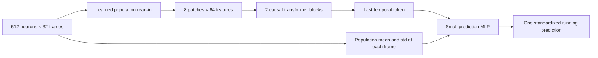

# Read the core in this order

The task is to predict a mouse's current running speed from a short history of measured neural activity. The clean implementation lives in `decoding/`. Importing it does not load recordings, train models, or write files. The original root `train.py` in the local workspace is an unchanged early prototype; its public snapshot is under `research/original_application/`.

| Read | File | The question it answers |
| --- | --- | --- |
| 1 | [config.py](../decoding/config.py) | What settings are fixed for each model? |
| 2 | [data.py](../decoding/data.py) | How do recordings become aligned input windows and targets? |
| 3 | [model.py](../decoding/model.py) | How do the transformer and MLP calculate one prediction? |
| 4 | [train.py](../decoding/train.py) | How do weights learn, and which checkpoint is kept? |
| 5 | [ridge.py](../decoding/ridge.py) | What can regularized linear regression achieve on the same inputs? |
| 6 | [evaluate.py](../decoding/evaluate.py) | How do we score fixed choices against actual held-out running? |

You can skip `portfolio/visualization/`, `tests/`, and the historical diagnostics while learning the core. The SHA-256 helpers identify exact files; their purpose is to detect changes between fitting and evaluation. They do not make a repeatedly examined dataset fresh again.

## One example through the system

For the selected transformer, one example is **512 neurons × 32 frames** of activity. A batch groups up to 64 examples. Each example's target is running at the final frame of that window. This is concurrent decoding; it is not a future-running forecast.

`data.py` selects 512 cells using only the first 60% of the recording. It uses that prefix to compute each cell's activity mean and standard deviation. Subtracting the mean and dividing by the standard deviation puts cells on comparable scales. Running is normalized using only the selected training targets. Neither later split determines these values.

The middle and final segments are validation and test, with 64-frame gaps. Each split discards its first 63 targets so histories of 16, 32, and 64 frames can be compared at exactly the same endpoints. The default training cap is 4,096 evenly spaced examples; validation and test use every remaining endpoint. Splits are chronological because neighboring frames are related.

In `model.py`, `readin` gives each of the 512 neurons its own learned weights. At each frame, matrix multiplication combines cells into 64 population features. Neuron identity is therefore encoded in these weights. There is no separate coordinate input or explicit ID embedding in this final design.

`patch` packs four consecutive frames into one token and projects them back to 64 features. `time` identifies token position; `session` identifies the recording. The two transformer blocks let each token use earlier tokens and itself. Attention weights depend on the input. Each block also includes a small MLP and residual additions, which add each block's adjustment to its input.

The final head receives the last token plus 32 population means and 32 population standard deviations. Its small MLP maps these 128 values to one running estimate. The output starts at zero in standardized units, which means the **training-average running speed**, not physical zero speed.

The population MLP shares this general organization but replaces attention with learned, input-independent temporal mixing followed by nonlinear layers. Its selected recipe uses two-frame patches and dropout. It is **not an RNN**: there is no recurrent hidden state carried step by step. The separately optimized recipes are the main comparison; a settings-matched comparison is retained in the development archive.

## Learning and choosing a checkpoint

`train.py` shuffles the training examples deterministically for each seed and epoch. It computes raw squared prediction error, runs `backward()` to calculate gradients, clips large gradients, and lets AdamW update the weights. The cosine schedule gradually lowers the learning rate. The last partial batch keeps the original experiment's weighting.

After each epoch, the model predicts the validation segment without gradient updates or dropout. Predictions below physical zero are clipped for scoring. The earliest checkpoint with the lowest validation MSE is kept, including the untrained epoch-zero model. Raw training loss is not clipped. The test segment is never loaded by fitting.

`ridge.py` flattens each neural history into a vector. It fits a weighted sum plus an intercept, penalizing large weights to reduce overfitting. Validation chooses among three history lengths and eight penalties. It standardizes these features using selected training examples only. The matrix solve uses example space to avoid constructing an enormous feature-by-feature matrix.

`evaluate.py` verifies that data, source files, and selected checkpoints match their fit receipts, then writes `lock.json` before loading test windows. It scores all supplied fits plus zero-speed and training-mean controls. A lock covers the supplied fits for **one recording**, not all mice in a future research study. The original seven-mouse study used a separate cohort-wide lock in the historical pipeline.

## Read the scores correctly

- **MSE:** average squared error; lower is better and large errors matter more.
- **MAE:** average absolute error; lower is better.
- **R²:** improvement relative to the test segment's own mean predictor. Zero means equal error; negative means worse. This test-mean reference is an evaluation statistic, not an available training-time predictor.
- **Zero-speed and training-mean controls:** practical constant predictions that can be made without fitting a neural model.

These values are in training-standardized running units. The raw publisher units and timing are not independently calibrated to physical speed and seconds. The viewer's animation illustrates the measurements; it is not a pose reconstruction or a generated nervous system.

## Details retained for compatibility

The model initially creates four recording slots and then adds three. The earlier study had four mice, and the later fixed-recipe study extended it to seven. Keeping this construction order preserves the original random initialization exactly. For independent fitting, one slot is kept. This historical detail is not a general requirement of transformers.

The cleaned model has been checked against all 72 frozen initial states and 2,016 sampled saved predictions. These are compatibility checks, not new evidence of superiority. The seven synthetic unit tests exercise the new code; the completed scientific gates remain unchanged.

Next, read `PopulationDecoder.forward()` and trace where each of its three concatenated inputs comes from. That is the shortest useful route to understanding the actual prediction.
