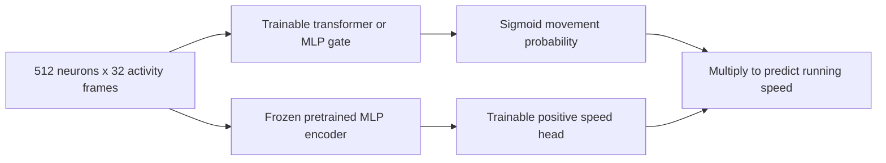

# Partial-transformer movement gate

This experiment asks whether attention can improve one part of behavior decoding: estimating movement probability. It tests a concrete quiet/active hypothesis after full-bank and local-retrieval repairs failed their consistency gates.

Four arms separate attention from explicit movement supervision:

| Arm | Movement gate | Training loss |
| --- | --- | --- |
| attention_bce | Temporal attention | Speed MSE + movement BCE |
| mlp_bce | Temporal MLP | Speed MSE + movement BCE |
| attention_mse | Temporal attention | Speed MSE only |
| mlp_mse | Temporal MLP | Speed MSE only |

The sigmoid output is a score between0 and1; calibration is evaluated, not assumed. Training BCE labels use the observed speed threshold, but observed behavior never enters prediction inputs. The two-part speed output can still predict false movement; it is a hypothesis, not an enforced correct quiet state.

All four arms have the same trainable speed head, the same frozen MLP feature source, the same input cells/history, batch order, optimizer and24-epoch budget. Within a gate family, BCE and MSE arms start with exactly identical parameters. Transformer versus MLP comparisons keep the common read-in, patch, output-head and speed-head initialization identical; mixers differ and parameter counts are reported.

Seven mice × three seeds × four arms =84 new fits. New seeds501–503 reuse the corresponding frozen MLP features from checkpoints401–403. Every checkpoint is chosen by validation speed MSE, including epoch0, and all84 selections must be locked before new test scoring. This reuses explored recordings and selected features, so it remains development evidence. It is not a full end-to-end feature-backbone experiment or an exhaustive architecture search.

## Code to understand

- `run.py`: `Decoder` defines the two branches and their product; `fit` defines MSE/BCE training and validation selection; `evaluate` scores locked models and matched controls
- `protocol.json`: the budget, comparisons, data restrictions and success criteria frozen before training
- `report.py`: independent checks and report rendering; no model fitting
- `fits/*/history.json`: training losses and every validation epoch, including unsuccessful runs

Prepared data and archived feature checkpoints must already exist locally. From the repository root, run `python3 experiments/2026-10-06_movement_gate/run.py` with stages `smoke`, `prepare`, `train`, then `evaluate`; finally run `python3 experiments/2026-10-06_movement_gate/report.py`. Completed results are hash checked and skipped by training; incomplete fit folders require explicit recovery rather than silent replacement. Do not rerun completed experiments to seek different outcomes.
