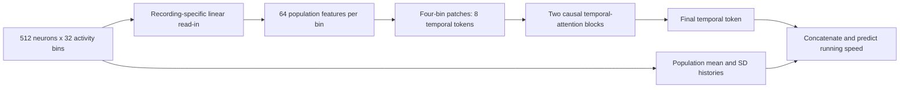

# Neural behavior decoding: what survives strong controls?

## Research question and outcome

Can neural activity decode running speed, and can combining a transformer with a strong MLP improve on either model and tuned linear regression? Earlier work also asked whether neuron coordinates add information beyond identity and activity.

**The main practical result is a two-model ensemble.** On four sensorimotor mice, the validation-selected MLP–transformer mix reduces mean relative test MSE by **25.10% versus tuned ridge**, **5.64% versus the standalone transformer**, and **5.34% versus the standalone MLP**. It wins on all four mice against each comparator. The original mix-versus-parent experiment was pre-registered; the ridge comparison is a later post hoc analysis on those now-examined recordings.

The standalone MLP and transformer already improve on ridge by 21.00% and 20.75%. Same-family seed ensembles perform similarly to the mixed ensemble at matched model count, so these results support averaging rather than a unique benefit from mixing architectures. The original learned correction gains only 1.16% beyond the mix, lowers quiet-frame predicted speed by 53.08%, and can worsen active MSE by 3.29%; it failed its frozen improvement gate. Later confidence gating did not resolve that trade-off.

The four-mouse result coexists with earlier failures: on seven visual recordings, transformer advantages were inconsistent and zero speed beat every tested neural recipe and ridge on two mice. All fits are within recording; no pretrained transfer, causal simulation, universal superiority, statistical significance or architectural novelty is claimed. [Current per-mouse table](results/current_models.csv) · [Ridge assessment](../experiments/2026-10-07_holdout_ridge/ASSESSMENT.md) · [Original holdout assessment](../experiments/2026-10-07_holdout_confirmation/ASSESSMENT.md).

## How the investigation developed

**Subsequent exploratory retrieval pilot (October 6):** Replacing the heads of 42 frozen checkpoints with training-label retrieval did not improve reliability. Transformer retrieval averaged **7.82% higher MSE** than its original head; MLP retrieval averaged **8.69% higher MSE**. Both improved four of seven mouse means, but neither reduced quiet-period false movement on any mouse, and both failed every frozen feasibility criterion. This reuses already examined recordings and is not independent confirmation. End-to-end learned retrieval remains untested. See the [full pilot and checks](../experiments/2026-10-06_frozen_retrieval/ASSESSMENT.md).

A [subsequent neighbor diagnostic](../experiments/2026-10-06_frozen_retrieval/neighbor_analysis/ASSESSMENT.md) found quiet training neighbors but diffuse retrieval weights on the two problematic mice. For TX104, 68.9% of the transformer's nearest16 neighbors were quiet versus34.0% in its training bank, but those neighbors received only9.5% of attention weight. This motivates a fixed local-retrieval test; it does not establish a hybrid benefit or identify the cause of session differences. No additional model was fitted.

The [completed top16 and hybrid follow-up](../experiments/2026-10-06_frozen_retrieval/local16/ASSESSMENT.md) found that localization alone worsened transformer/MLP mean relative MSE by39.13%/43.08%. Validation-selected blends reduced mean relative error by6.22% for each family, entirely through TX103: retrieval was selected there and the original head retained on all six other mice. TX103 transformer R² rose0.471→0.701, but quiet false movement worsened there, and no mouse improved on that endpoint. All full feasibility gates failed. This is a recording-specific exploratory improvement, not a validated hybrid or transformer advantage.

| Phase | Question | Durable lesson |
| --- | --- | --- |
| Spatial representations | Do correct positions help beyond activity and identity? | Small, inconsistent retraining gains; test-time reliance does not establish incremental value. |
| Activity relationships | Do functional grouping, attention and learned neuron readouts improve behavior decoding? | Correlation structure can persist without producing dependable predictive gains. Attention maps are not synaptic evidence. |
| Fair baselines and hybrids | Can pretraining, residual correction, mixed MLP/attention paths or calibration rescue performance? | Several attractive averages failed seed/mouse consistency or stronger controls. Different optimization budgets and ensembles require explicit comparisons. |
| Population representations | Can a short sequence of population states replace many neuron-time tokens? | Both transformer and MLP population models substantially reduce measured forward cost. Attention does not uniquely explain that benefit. |
| Systematic optimization | What survives a larger fixed structural/recipe search? | A better development transformer still lost to the independently tuned population MLP. The improvement-over-small-transformer consistency criterion failed. |
| Separate recordings | Do fixed recipes remain useful on seven separate mice? | No primary superiority gate passed; absolute prediction was weak on five mice, with two failures against zero speed. |

The [54-folder catalog](data/ARCHIVE.md) includes feasibility work, syntheses and reused fits. It is not a biological sample count. The stopped cross-neuron reconstruction study completed fitting but was halted before its later evaluation when the objective returned to behavior; it is not scored as a failed evaluated experiment. Generation remains a deferred objective.

## The evaluated architecture

**Matched ridge comparison (post hoc):** On D3/D4/D7/D9, the saved transformer–MLP blend reduces mean relative test MSE by **25.10% versus validation-tuned ridge**, winning on 4/4 mice and 12/12 seed comparisons; mean relative MAE improves 26.20%. Ridge receives the same neurons, training examples and test frames, with validation-selected history (16/32/64) and regularization. Against a matched 32-frame ridge, the blend gains 27.85%. Both standalone neural models also beat tuned ridge (transformer 20.75%, MLP 21.00%; 4/4 each), so the whole gain cannot be attributed to mixing models. The blend improves both quiet and active MSE against ridge on every mouse. This supplements the earlier pre-registered neural-parent comparison; the new ridge comparison is explicitly post hoc on now-examined mice, uses more compute for the ensemble, and does not establish cross-animal transfer or erase the earlier mixed seven-mouse result. All 96 validation options, 8 selections, 52 metric records and 6 contrasts passed the completed audit. [Full assessment](../experiments/2026-10-07_holdout_ridge/ASSESSMENT.md).

**Confidence-gating follow-up (no training):** A validation-selected, downward-only correction triggered by low movement scores retained a large quiet-period effect on the four previously held-out mice:52.59%lower mean quiet-frame predicted speed versus the blend. But total MSE improved only0.62% (3/4 mice), and active MSE worsened by up to3.26%, failing the predeclared1%harm limit. The existing correction already achieved53.08%quiet reduction and1.16%total-MSE improvement; confidence gating did not improve it overall and did not outperform a matched downward-only control. This is exploratory reuse of now-examined recordings, not a new confirmation or a change to the successful ensemble result. [Full findings and absolute quiet predictions](../experiments/2026-10-07_confidence_gate/ASSESSMENT.md).

**Movement-supervision follow-up:** A trainable movement gate with an MLP speed head reduced quiet false movement on all seven mice. The attention version averaged8.01% lower MSE than the original MLP, but improved total MSE on only3/7 mice and hurt active-period prediction on6/7. The all-MLP counterpart achieved similar gains. All full gates failed; the result identifies a quiet/active trade-off rather than a reliable replacement. See [the84-fit study](../experiments/2026-10-06_movement_gate/ASSESSMENT.md).

**Bounded-hybrid follow-up (63 fits):** The original transformer and MLP were frozen and combined in a validation-selected convex blend. A small activity encoder then added a bounded correction, scaled down when its movement score was high and penalized on active frames. The attention+BCE version averaged 10.03% lower MSE than the original transformer and 11.79% lower than the original MLP, winning on 7/7 mice against each. The matched MLP+BCE correction performed similarly (+9.71%/+11.54%). Every per-parent check passed, but every arm failed the full gate. The BCE arms worsened TX61 active-period MSE by more than 5% relative to the blend; the MSE-only arm gained only 1.40% over the blend. The blend alone already beats both parents on 7/7 mice (+3.87%/+6.18%). The correction's further gain comes almost entirely from TX104 and TX61, where zero speed still beats every model. On the other five mice, the gain over the blend averages about zero. Ensembling is a dependable small gain; the learned correction is not yet shown to add reliably beyond it. See [the assessment](../experiments/2026-10-07_bounded_hybrid/ASSESSMENT.md). A follow-up chose the correction's strength and direction on validation data without retraining. It improved each arm by about 0.4%, but all gates still failed: TX61 running-period harm persisted even when the correction could only lower predictions ([refinement](../experiments/2026-10-07_correction_scaling/ASSESSMENT.md)).

**Holdout confirmation on never-used mice (pre-registered):** The recipe was frozen before download and then run on public recordings never used in development. Four sensorimotor-cortex mice were usable; D8 was excluded by a preset rule, and two later visual sessions were excluded because the publisher packaged another mouse's running trace in them. Under the unchanged thresholds, **the validation-selected transformer/MLP blend beat both standalone models**: +5.64% MSE versus the transformer (4/4 mice, 11/12 seeds) and +5.34% versus the MLP (4/4, 10/12), with no mouse harmed. This is the project's first pre-registered pass. The margins are thin, the sample is four mice from one lab, and the blend is a two-model ensemble rather than a better single architecture. The bounded correction again added only 1.16% over the blend and failed its gate. A post hoc same-cost control then showed that averaging two seeds of the same family performs as well (blend −0.44% versus a transformer pair, −0.81% versus an MLP pair). So the gain comes from ensembling, not from combining architectures. A follow-up [ensembling check](../experiments/2026-10-07_ensemble_check/ASSESSMENT.md) found that averaging two seeds of the same model beats a single model by 5.4–6.1%. That held on 7/7 development and 4/4 holdout mice for both architectures, with no mouse harmed. Three-seed averages gained 7–8%. Plain ensembling is the most reliable improvement found. See [the holdout assessment](../experiments/2026-10-07_holdout_confirmation/ASSESSMENT.md).

The development-selected population transformer receives 512 identified neurons × 32 activity bins per example. It predicts running at the final input time. That is concurrent decoding with a history, not forecasting future behavior.

Neuron identity is represented by the neuron-specific read-in weights; coordinates are absent. Time and session embeddings are added before temporal processing. Each attention block contains both attention and a feed-forward MLP, with normalization and residual connections. Thus “transformer versus MLP” means comparing the full decoder families, not claiming a transformer has no MLP inside it.

The strongest population-MLP control keeps the population read-in, population statistics and prediction head, with learned causal temporal mixing and channel MLPs in place of temporal self-attention. Independent tuning selected a different patch size and dropout. That comparison addresses the best tested recipes within each family, not the isolated causal contribution of attention. A matched-settings MLP is also retained in development results; the transformer averaged 3.46% higher MSE against it.

| Recipe | Width / depth | History / patch | Dropout | Learning rate / weight decay | Epoch cap |
| --- | --- | --- | --- | --- | --- |
| Selected population transformer | 64 / 2 | 32 / 4 | 0 | 0.001 / 0.001 | 48 |
| Selected population MLP | 64 / 2 | 32 / 2 | 0.1 | 0.001 / 0.001 | 48 |
| Small population transformer | 16 / 1 | 32 / 4 | 0.05 | 0.001 / 0.01 | 24 |

The four-session development transformer has 223,809 parameters; the selected population MLP has 216,029. Recording-specific components make parameter counts depend on the number of sessions; these counts must not be presented as universal independent-fit counts. The old local-neuron MLP has 42,903 parameters but much higher measured forward cost. Parameter count alone does not predict runtime.

## Bounded optimization, not a universal optimum

The systematic study screened 54 transformer and 54 population-MLP structures: widths 16/32/64, depths 1/2/3, histories 16/32/64 and patches 2/4. Each was screened for 12 epochs on two chronological development folds. The top two structures per family received longer, predeclared recipe tuning; local-MLP controls were included. The study completed 440 new neural fits. Six finalist roles were compared with seeds 201–206, with separate requirements for each three-seed subset as well as their pooled summary.

The winning transformer width sits at the upper search boundary. Twenty-eight transformer screening fits selected the short epoch cap, so slower learners may have been screened out. Only two structures per family received longer recipe tuning. Local-MLP structure, larger widths, alternative objectives and all possible architectures were not exhaustively optimized. No final transformer selected the 48-epoch cap, but that does not prove global convergence.

The separate continuous-search work package contains 60 additional neural fits, and new-recording validation adds 72, for **572 new fits across these three non-overlapping work packages**. Earlier fits are not included in this conservative subtotal. Analytic ridge solutions, reused checkpoints and technical seeds are not counted as new animals or added to the neural-fit subtotal.

## What the comparisons show

Primary scores average each trained model's MSE over test targets, then average those errors over seeds within mouse. Relative gains are computed per mouse and finally averaged with equal mouse weight:

\[
g_m = 1 - \frac{\operatorname{mean}_s\mathrm{MSE}_{T,m,s}}{\operatorname{mean}_s\mathrm{MSE}_{C,m,s}},\qquad
G = \operatorname{mean}_m g_m.
\]

Positive gain favors the transformer. Averaging predictions before scoring is an ensemble endpoint and is not substituted for this primary score. MSE is measured in each recording's training-standardized target units; raw MSE values must not be pooled across recordings as though they had one common physical scale.

| Transformer comparison | Development: four reused mice, shared fits | Separate: seven mice, independent fits |
| --- | --- | --- |
| Versus selected population MLP | −10.28% mean MSE gain; 0/4 mouse wins | +2.33%; 3/7 mouse wins; MAE 1.20% worse |
| Versus smaller transformer | +13.01%; 3/4 wins; required first seed subset failed | −0.22%; 4/7 wins |
| Versus ridge | +39.38%; 4/4 wins; practical development criteria passed | +8.17%; 3/7 wins; primary gate failed |

Every separate-cohort primary contrast has Holm-adjusted two-sided animal sign-test **p = 1** and fails its practical gate. This does not prove equivalence or that transformers cannot work. It shows that the proposed advantage did not satisfy the prespecified evidence requirements here. Seven independent mice permit a smaller minimum exact sign-test p-value than four, but sample count cannot rescue inconsistent directions of effect.

Jointly fitting the seven new recordings was a secondary descriptive analysis because pooled training couples the animals. Its transformer averaged **1.50% higher MSE** than the selected MLP and won only 2/7 mouse means. The favorable independent-fit average cannot replace this outcome; neither can be chosen after looking at results as a rescue claim.

The separate practical rule required at least 5% mean relative MSE gain, at least 6/7 mouse wins, at least 14/21 individual-seed wins, no mouse more than 10% worse, and nonnegative mean MAE gain. A validated advantage also required the adjusted significance test and beating the training-mean control in every mouse mean. The archived thresholds were not changed for this presentation.

See [all results](results/RESULTS.md), [per-seed metrics](results/per_seed_metrics.csv), [per-mouse metrics](results/per_mouse_metrics.csv) and [every contrast](results/contrasts.csv).

## Three findings beyond the leaderboard

**Coordinates and learned identities can be redundant on known cells.** In the earlier additive tokenizer, a token was activity embedding + free ID embedding + coordinate embedding. For a fixed cell, replace its ID vector by `old_ID + position(real) - position(changed)`. The sum, and hence all downstream predictions, remains unchanged for any activity input. This is an algebraic property of that representation, not a biological assertion. Archived checks across twelve trained models recovered predictions within 1.67e-6. Removing coordinates only at inference raised error 6.35%, yet retraining without them changed mean error by only about 0.50%, with uncertainty intervals crossing zero. Reliance and added predictive information are different questions. Coordinates can still supply a useful prior for unseen cells or under constrained identity embeddings; that was not proved by the fixed-cell experiment.

**Population compression improved measured computational cost for both model families.** On the saved two-thread CPU benchmark, median batch-64 forwards took 5.61 ms for the selected population transformer, 5.82 ms for the population MLP, and 84.97 ms for the selected local MLP. That is roughly 15× less forward time for either population model. Batch-one timings were 0.371, 0.334 and 1.752 ms respectively. The benchmark used six seeds, randomized interleaved trials, 30 timed forwards and five warmups. It excludes preprocessing, I/O and GPU execution. It is not a claim of equal accuracy: the transformer harmed MP030 relative to the selected local MLP.

**Absolute controls exposed failure that relative gains obscure.** The separate transformer beat ridge on average, yet on TX104 and TX61 every tested neural recipe and ridge lost to zero speed. Transformer MSE was 20.01× and 3.99× that constant's error. Test target SD was only 0.125 and 0.270 of training SD, and test mean running shifted downward by 0.894 and 0.448 training SD. Posthoc squared prediction bias accounted for 37.9% and 34.0% of transformer MSE, leaving substantial fluctuation error too. Low-running periods are an observed failure context; causal responsibility of behavior shift, activity shift, preprocessing, sampling rate or training coverage has not been isolated.

The [full seven-mouse traces](results/all_mouse_traces.png) show every test interval and every mouse. Lines average three trained predictions for illustration; shading shows the seed range, not a confidence interval. The numerical results score individual models. Vertical scales differ, and native frames are not labeled as seconds.

An additional archived, posthoc panel-size comparison favored 512 rather than 128 cells in all four development mice: approximately 30.35% lower MLP pair-ensemble MSE and 32.24% lower ridge MSE. This older endpoint differs from the newer individual-seed primary endpoint. More cells also change model capacity, population summaries and regularization behavior; it does not isolate an attention benefit or provide new confirmation.

## What was validated—and what was not

The seven separate visual-cortex recordings were selected by an outcome-independent rule: the earliest recording for each of TX103, TX104, TX56, TX57, TX60, TX61 and VR2 in Facemap v2. Published IDs, dates and ages support non-overlap with the old MP cohort; direct identity confirmation from the authors was not obtained. The cohort remains a small convenience sample from one laboratory and brain region, not a random sample of all mice or behaviors.

Each independent fit used 512 random training-eligible cells, at most 4,096 evenly spaced training targets, chronological 60/20/20 partitions with 64-frame gaps, and a common 63-frame warmup. Activity and target scaling used training data only. Validation selected checkpoints, including epoch zero as a control; all final checkpoints were locked before test predictions. Three seeds were used per recipe. Ridge selected from three histories and eight penalties using validation data. No separate-cohort architecture search occurred.

Some released activity/run arrays differed by one terminal sample. A documented **pre-fit** protocol amendment kept the common valid prefix, following the author's same-index convention. No shift, interpolation or outcome-based alignment was selected. Raw ball-sensor synchronization was not independently reconstructed. This explicit convention is not proof of physical alignment.

The old release used nominal 1.2-second analysis bins; the new protocol retained 32 native frames and did not verify a physical seconds conversion. Facemap v2 also changed publisher deconvolution/motion correction. Consequently this is validation of fixed recipes on a separate release, **not a controlled test of behavior shift alone with identical physical input histories**. These differences could contribute to performance changes; their contribution is unmeasured. The absolute-zero-control failures occur within the separate cohort and remain valid regardless of a cross-release explanation.

Earlier audits checked checkpoint reloads, chronology, training-only scaling, batch-order matching and saved metrics. The present package adds a separate portability check for exported results; it does not redo those training audits. The archive has a long history of adaptive searching. No old test interval is relabeled as untouched confirmation. Further tuning on either current cohort would be development.

## A sensible stopping point and future research question

The current defensible endpoint is a combined decoder supported by the four-mouse comparison, alongside strong MLP, transformer and ridge references and the preserved failure analysis. The plain mix is the presentation default; the learned correction remains experimental. Same-family ensemble controls prevent an unsupported claim that mixing architectures uniquely explains the gain. More trials on the same tails would not create independent confirmation.

If new scientific work is later authorized, the narrower question is: **can a fixed decoder remain useful across transitions between quiet and active running periods?** Physical time support and preprocessing should first be harmonized on development recordings, followed by a preregistered comparison of one justified remedy against the same MLP, ridge, training-mean and zero-speed controls. Absolute error, quiet-period false movement and per-mouse consistency should be fixed before scoring genuinely unused data. The quiet threshold, minimum useful effect and any recipe-selection rule must also be chosen on development data. Existing simple scale/offset calibration and several robustness approaches already failed; they should not be presented as untested breakthroughs or automatically rerun. No such new experiment is launched here.

## Data and related work

- **Original recordings:** [Stringer et al., “Spontaneous behaviors drive multidimensional, brainwide activity” (2019)](https://pmc.ncbi.nlm.nih.gov/articles/PMC6525101/) and its [public data](https://figshare.com/articles/Recordings_of_ten_thousand_neurons_in_visual_cortex_during_spontaneous_behaviors/6163622). This project reuses published activity and behavior rather than collecting experiments.
- **Separate cohort:** [“Facemap: a framework for modeling neural activity based on orofacial tracking”](https://pmc.ncbi.nlm.nih.gov/articles/PMC10774130/), the [version-2 dataset](https://janelia.figshare.com/articles/dataset/Facemap_a_framework_for_modeling_neural_activity_based_on_orofacial_tracking/23712957/2), and [pinned author plotting code](https://github.com/MouseLand/facemap/blob/f8b5b518efcde8b4aae7727283bf017b23641c7f/paper/fig4.py). Our endpoint predicts running from neural activity; it is not a reproduction of the paper's principal modeling task.
- **Neural Data Transformers:** [Ye and Pandarinath (2021)](https://arxiv.org/abs/2108.01210) study transformer representations of neural population dynamics. Neural transformers predate this project.
- **POYO:** [Azabou et al. (2023), author project and paper](https://poyo-brain.github.io/) use population read-in, latent attention and behavior queries for multi-session neural decoding. Population compression and behavior-oriented attention are established ideas, not novelty claims here.
- **POYO+:** [Author project and ICLR 2025 paper](https://poyo-plus.github.io/) extend multi-session, multi-task decoding to calcium recordings. The existence of successful neural-transformer work does not establish success on this particular running-speed benchmark, and our failures do not refute that literature.

These sources motivate and bound the project. Their datasets, input modalities, targets, training scales and splits differ. We did not reproduce these published systems head-to-head, and their reported performance is not placed on our leaderboard.
