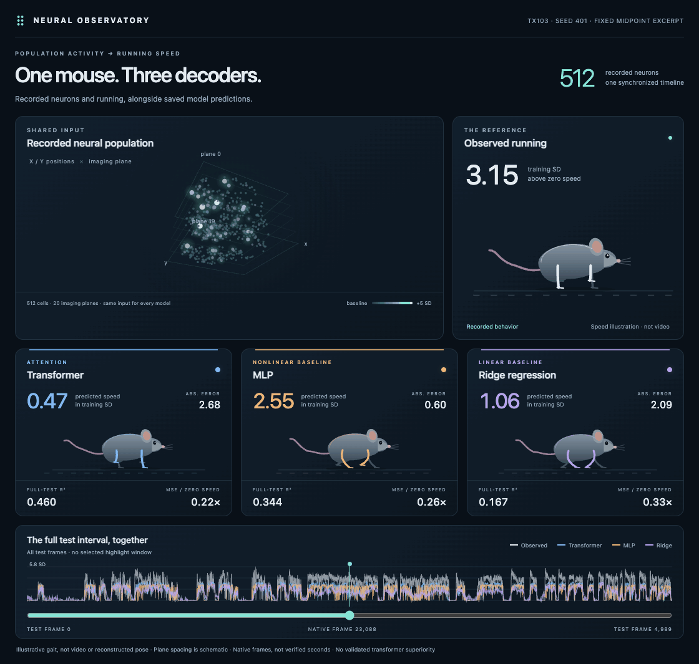

# Neural Observatory

**One recorded neural population, three prediction paths:** the MLP–transformer mix, the mix with its original learned correction, and validation-tuned ridge regression. A fourth mouse illustrates the observed running speed.

Open [index.html](index.html) in a browser. Keep it beside `style.css`, `app.js` and `data.js`. It works offline without a server or model inference.



[Static preview](preview.png) · [Five-model results chart](../results/current_models.png) · [Correction trade-off](../results/correction_tradeoff.png)

## What you can explore

- All four sensorimotor mice (D3/D4/D7/D9), three paired parent seeds (401/402/403), and every scored test frame: **18,892 frames** total. The correction seeds are 601/602/603, paired respectively. Ridge is deterministic.
- Drag or use arrow keys to rotate the neuron cloud; scroll to zoom; reset to the fixed oblique view. Hover to inspect the original cell index and published position.
- Play, pause, step, scrub or click the timeline. The selected recording, frame and seed drive all panels together. Reduced-motion preferences disable autoplay.
- Full-test R² and MSE relative to zero speed describe the displayed seed, not a favorable excerpt or the seed-mean chart. A ratio above 1 means the zero-speed constant is better.

The mix is the main model. The correction is the original full-strength attention+BCE branch, **not** the later confidence-gated variant. It is included to expose the trade-off: quiet predictions improve, while active-period error can worsen. See [the assessment](../../experiments/2026-10-07_holdout_confirmation/ASSESSMENT.md).

## Recorded, predicted, illustrated

**Recorded:** published x/y positions and imaging-plane indices, selected neurons’ prepared activity, and aligned running speed. **Predicted:** archived test outputs. **Illustrated:** mouse gait and spacing between imaging planes. This is not animal video, recovered body pose, measured connectivity, calibrated anatomical depth or a neural generator.

`panel[i]` maps an input channel to the same original neuron row in the position arrays. Activity begins 63 frames into the prepared test segment, matching the scored targets. All paths use the same 512 neurons and target frames. The neural parents use 32-frame histories; ridge selects 16/32/64 using validation only. Coordinates are visualization inputs, not decoder inputs.

Colors show activity relative to each cell’s training mean/SD, clipped to 0–5 SD and quantized to 8 bits. No model or metric uses those display colors. x/y share a scale to preserve aspect ratio; the displayed plane indices come from the selected recording. Plane spacing is schematic.

Speed is nonnegative published running divided by training-target SD. Physical speed units and acquisition seconds were not independently verified. “Frames/s” controls display playback only. Numeric speeds, errors and activity remain unsmoothed native-frame values; continuous gait phase makes the animation smooth between samples.

## How the README clip was selected

D3 is the first recording;401 is the first paired seed. The GIF uses the **earliest 144-frame interval** satisfying a fixed observed-behavior-only rule: first and last 12 frames quiet, at least 36 quiet and 36 active frames, and at least 24 consecutive active frames. Quiet is ≤0.05 training SD above zero; active is ≥0.5. No prediction or model error enters this selection.

The selected interval is test frames **718–861**: 60 quiet, 76 active and 8 intermediate frames. At 12 native frames per display second, it lasts 12 seconds. Gait is sampled at **50 animation frames/s** with a fixed camera and all 512 cells visible. This is one illustration, not a representative accuracy estimate. In particular, the correction’s full-test MSE is worse than the mix on D3.

## Rebuild the viewer

The exporter requires NumPy plus the existing local holdout, ridge and raw publisher position arrays:

```bash
python3 portfolio/visualization/build_data.py
```

It reads small position arrays, prepared test activity and saved predictions. No new neural fits or inference occur. Generated `data.js` is about 13.8 MB; it includes every test frame and 512 activity colors per frame. Raw full-population recordings and checkpoints are not copied.

Optional GIF tooling needs Node, Playwright 1.56.1, local Chrome and Python with Pillow/NumPy. Keep capture frames and optional dependencies outside the repository:

```bash
npm install --prefix /tmp/neural-presentation-tools playwright@1.56.1 --no-audit --no-fund --ignore-scripts
NODE_PATH=/tmp/neural-presentation-tools/node_modules node portfolio/visualization/capture.js
python3 portfolio/visualization/encode_gif.py /tmp/neural-presentation-capture
```

`capture.js --preview` makes a still preview without the full animation. `NEURAL_CAPTURE_DIR` changes the temporary capture directory. Encoding uses one shared palette and changed-region GIF compression. Rebuilding replaces the presentation assets, never experiment records.

## Verification and provenance

[Data checks](data_review.json) record panel/target alignment, source hashes, activity quantization and agreement with archived metrics. [Browser checks](browser_review.json) cover 36 first/middle/last-frame cases, 144 speed checks, 432 metric-value checks, playback and frame controls, camera reset, a 390px mobile layout and no external requests or runtime errors. [GIF checks](gif_review.json) verify 600 capture positions, 2400 displayed speeds, fixed camera, full-test metric consistency and 12-second encoded duration.

The original neural-parent comparison was pre-registered; ridge and the current presentation are post hoc on now-examined mice. Every model was fitted within its own recording. The animation cannot establish transfer or statistical significance. The earlier seven-mouse viewer and its assets remain in Git history; the historical numerical results remain in the research archive.

Dataset-derived assets retain [CC BY-NC 4.0 terms and attribution](../../NOTICE.md). [Research report](../RESEARCH_REPORT.md) · [Current metrics](../results/current_models.csv).
